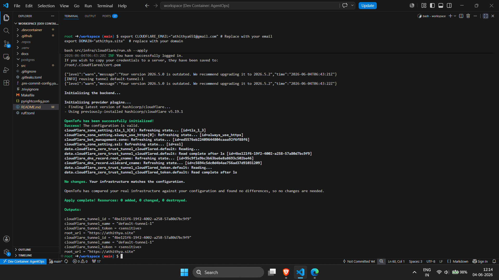
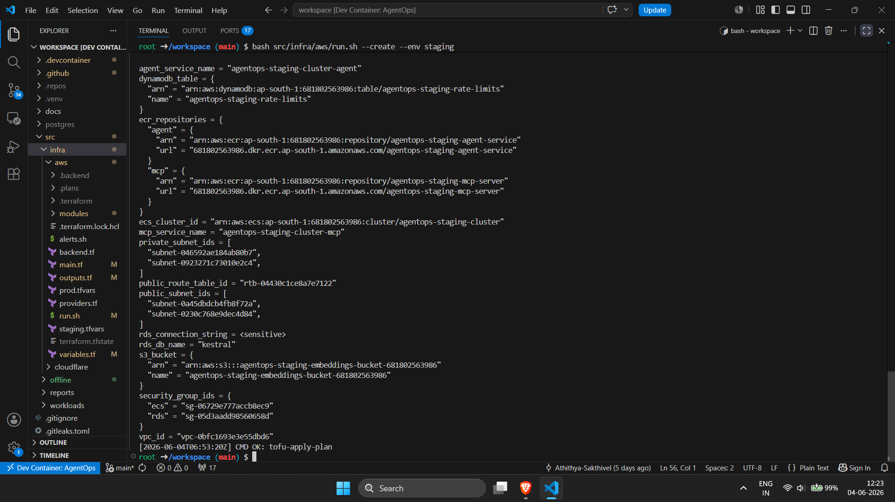
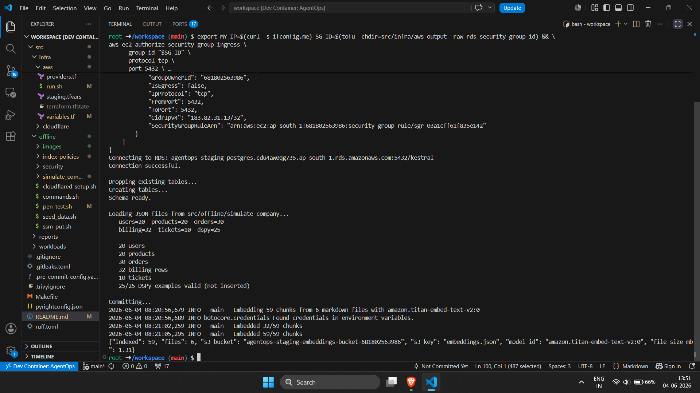
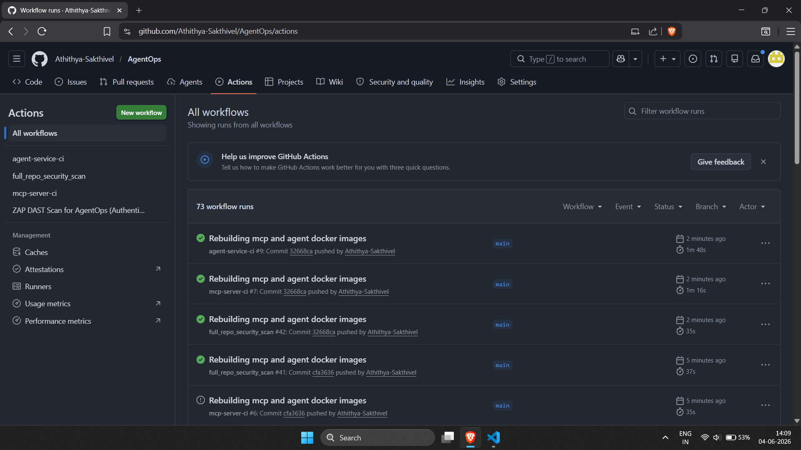
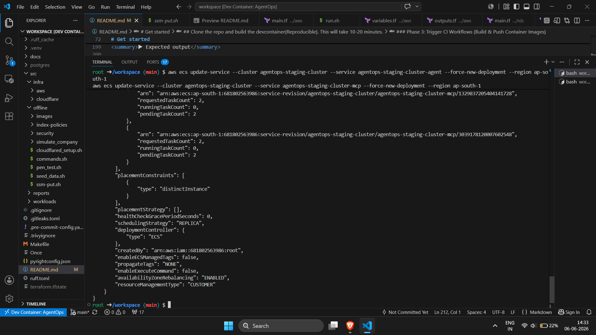
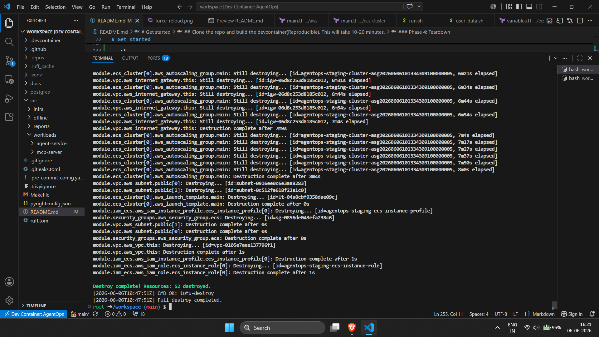

# AgentOps

**AI‑powered ticket triage for e‑commerce support teams — built with LangGraph, DSPy, and Bedrock — deployed on AWS for $23/month.**

AgentOps receives customer messages via WebSocket, classifies them with a DSPy‑optimised guardrail, gathers customer context (profile, orders) through an MCP server, then deterministically routes every issue to the correct human team. A LLM‑driven “ticket router” writes a 2‑3 sentence summary and a suggested action — support agents see the whole picture instantly and resolve tickets in seconds. The system **never** issues refunds, credits, or pickups autonomously; its only job is to make human agents faster and more accurate.

Stack: `FastAPI` · `LangGraph` · `DSPy` · `Bedrock Llama 3 8B` · `FastMCP` · `PostgreSQL`  · `ECS`· `S3` · `CloudWatch` · `Cloudflare Tunnel`

---

## Architecture

```
WebSocket Message
      │
      ▼
┌─────────────────────────────────────────────────────────┐
│                    LangGraph Agent                       │
│                                                          │
│  ┌──────────────────┐    ┌──────────────────┐           │
│  │   guardrail      │───▶│    context       │           │
│  │   classifier     │    │    gatherer      │           │
│  └────────┬─────────┘    └────────┬─────────┘           │
│           │                       │                     │
│           │ unsafe / urgent       │                     │
│           ▼                       ▼                     │
│  ┌──────────────────┐    ┌──────────────────┐           │
│  │   human          │    │   ticket         │           │
│  │   escalate       │    │   router         │  LLM+tools│
│  └──────────────────┘    └────────┬─────────┘           │
│                                   │                     │
│                                   ▼                     │
│                            Final Response               │
│                                                          │
│  State persisted via AsyncPostgresSaver                  │
└─────────────────────────────────────────────────────────┘
      │
      ▼
  WebSocket Response (JSON)
```

**Four LangGraph nodes**  
1. **Guardrail classifier** – DSPy‑compiled triage program (Llama 3 8B, temperature 0) classifies safety, intent, urgency, and sentiment. Unsafe or urgency ≥ 10 → immediate human escalation.  
2. **Context gatherer** – Fetches customer profile + last 5 orders (with product names) from the MCP server using the user’s email.  
3. **Ticket router** – LLM with two tools: `search_policies` (inline RAG) and `create_ticket`. Simple policy questions get an instant answer; issues needing human action produce a structured ticket with AI‑written summary and suggested action. Team assignment is **deterministic** (hard‑coded intent‑to‑team map), not left to the LLM.  
4. **Human escalate** – Skips the LLM entirely; directly creates a high‑priority ticket via MCP for dangerous or extremely urgent messages.

**State & persistence**  
All conversation state is checkpointed to PostgreSQL after every node via `AsyncPostgresSaver` — the agent survives restarts and resumes any in‑flight conversation.

**MCP server**  
Three tools exposed over FastMCP: `lookup_customer`, `get_recent_orders`, `create_ticket`. It owns **zero** business logic — all routing, summarisation, and policy decisions stay in the agent.

**Inline RAG**  
Policy documents are pre‑embedded with Bedrock Titan v2, stored as a single ~1.3 MB JSON file in S3, loaded once at startup, and searched with in‑process NumPy cosine similarity (<5 ms). No vector database required.

---

## Key design decisions

| Decision | Why |
|----------|-----|
| **Never act autonomously** | The agent cannot refund, credit, or schedule pickups. Those tools were deliberately removed from the MCP server. |
| **Deterministic routing** | A hard‑coded `INTENT → TEAM` table guarantees 100% predictable ticket assignment. |
| **DSPy guardrail first** | Every message is classified **before** any context is fetched or any tool is called. |
| **Cost‑optimised infra** | Cloudflare Tunnel, ECS Managed Instances, and inline RAG cut costs by 91% ($414 → $23/month). |
| **Zero inbound ports** | All traffic enters via Cloudflare Tunnel; security groups have no inbound rules. |
| **Observability built in** | JSON logs with correlation IDs, CloudWatch metric filters, dashboards, and alarms. |

---

# Get started

## Prerequisites
1. **Docker installed, running *without* sudo access**
2. **Visual Studio Code with the Dev Containers extension installed (for a deterministic environments): [https://code.visualstudio.com/docs/devcontainers/containers](https://code.visualstudio.com/docs/devcontainers/containers)**
3. **An AWS account with sufficient IAM permissions (AdministratorAccess or equivalent) to manage**:
   * Amazon ECS (Elastic Container Service)
   * EC2, VPCs, Subnets, and Security Groups
   * Amazon S3, SSM, ECR
   * IAM Roles, Policies, and Instance Profiles
   **AWS Free Tier is sufficient for development and testing purposes.**
4. **A Cloudflare account with a registered domain, with permissions to manage DNS records and create Cloudflare Tunnels (cloudflared)**

## Clone the repo and build the devcontainer(Reproducible). This will take 10-20 minutes. 
```sh 
cd $HOME && rm -rf E2E-RAG-System && git clone https://github.com/Athithya-Sakthivel/AgentOps.git && cd AgentOps && code .
```
> ctrl + shift + P -> paste `Dev containers: Rebuild Container Without Cache` and enter

### Open a new terminal and login to your gh account
```sh
git config --global user.name "Your Name" && git config --global user.email you@example.com
gh auth login

? What account do you want to log into? GitHub.com
? What is your preferred protocol for Git operations? SSH
? Generate a new SSH key to add to your GitHub account? No
? How would you like to authenticate GitHub CLI? Login with a web browser

! First copy your one-time code: <code>
- Press Enter to open github.com in your browser... 
✓ Authentication complete. Press Enter to continue...
```

### Create a private repo in your gh account

```sh
export REPO_NAME="AgentOps" # or any name
git remote remove origin 2>/dev/null || true
gh repo create "$REPO_NAME" --private >/dev/null 2>&1
REMOTE_URL="https://github.com/$(gh api user | jq -r .login)/$REPO_NAME.git"
git remote add origin "$REMOTE_URL" 2>/dev/null || true
git branch -M main 2>/dev/null || true
git push -u origin main
git pull
git remote -v
echo "[INFO] A private repo '$REPO_NAME' created and pushed. Only visible from your account."
```
---

### Phase 1: Infrastructure Foundation

#### 1.1 Set Up Cloudflare Tunnel and DNS. [Docs](src/infra/cloudflare/README.md)
Creates a `athithya.site` CNAME record → Cloudflare Tunnel and deploys a `cloudflared` daemon that routes HTTPS/WSS traffic into the VPC **without a load balancer or public IPs**. The tunnel terminates on each EC2 host and forwards to `localhost:8000` (agent‑service). Requires a browser login to your Cloudflare account.

```sh
export CLOUDFLARE_ACCOUNT_ID=
export CLOUDFLARE_GLOBAL_API_KEY=
export CLOUDFLARE_EMAIL="athithya651@gmail.com" # Replace with your email
export DOMAIN="athithya.site"  # replace with your domain
bash src/infra/cloudflare/run.sh --apply
```

<details>
<summary>▶ Expected output</summary>



</details>

#### 1.2 Provision AWS Infrastructure. [Docs](docs/infra.md)
Provisions a VPC (public subnets for ECS, private subnets for RDS), a 2‑node ECS cluster on `t4g.small` ARM64 instances, S3 (policy embeddings), DynamoDB (rate‑limiting counters), RDS PostgreSQL (business data + LangGraph checkpoints), ECR repositories (immutable tags, scan‑on‑push), and least‑privilege IAM roles — all declared in OpenTofu.

```sh
export TF_VAR_region="ap-south-1"
export TF_VAR_github_repository="Athithya-Sakthivel/AgentOps"   # replace with your GitHub repo
bash src/infra/aws/run.sh --create --env staging
```

<details>
<summary>▶ Expected output</summary>



</details>


### Phase 2: Data Preparation (Mimic a fictional e‑commerce company named Kestral)
- Creates the `users`, `products`, `orders`, `billing`, and `tickets` tables and populates them with synthetic data so the agent has customers to look up and orders to reference. [Docs](docs/pg_tables.md)
- Generates Bedrock Titan v2 embeddings for 6 internal policy Markdown files (~59 chunks), writes a single `embeddings.json` to S3, and loads it in‑memory at agent startup for sub‑5ms brute‑force cosine retrieval. [Docs](docs/serverless_rag.md)

The command below temporarily allows your IP into the RDS security group, runs the seed script, indexes the policy documents, and uploads the embeddings:

```sh
export MY_IP=$(curl -s ifconfig.me) SG_ID=$(tofu -chdir=src/infra/aws output -raw rds_security_group_id) && \
aws ec2 authorize-security-group-ingress \
    --group-id "$SG_ID" \
    --protocol tcp \
    --port 5432 \
    --cidr "${MY_IP}/32" \
    --region "${TF_VAR_region:-ap-south-1}" && \
export DATABASE_URL="$(tofu -chdir=src/infra/aws output -raw rds_connection_string)" && \
python3 src/offline/simulate_company/setup_postgres.py && \
bash src/offline/index-policies/commands.sh
```

<details>
<summary>▶ Expected output</summary>



</details>

```markdown
### Phase 3.1: Trigger CI Workflows (Build & Push Container Images)

Pushes the `AWS_ACCOUNT_ID` and `AWS_REGION` secrets to GitHub, then makes a trivial whitespace commit to trigger the CI pipelines. GitHub Actions authenticates to ECR via OIDC (no static credentials), builds the `agent-service` and `mcp-server` Docker images, scans them with Trivy, and pushes them to ECR with immutable tags.

```sh
gh secret set AWS_ACCOUNT_ID --body $(aws sts get-caller-identity --query Account --output text)
echo " " >> src/workloads/agent-service/infra_tests.sh
echo " " >> src/workloads/mcp-server/test_locally.sh
gh secret set AWS_REGION --body $TF_VAR_region
git add . && git commit -m "Rebuilding mcp and agent docker images" && git push origin main
```

<details>
<summary>▶ Expected output</summary>



</details>

### Phase 3.2: Store OAuth Secrets in AWS SSM Parameter Store

The agent‑service authenticates users via Google OAuth (Microsoft is optional). These secrets are stored in SSM Parameter Store — never in code or environment variables — and fetched at runtime by the ECS task role with KMS decryption. By default all google domains are allowed in both user and admin login.

> 🔑 **OAuth Setup:** [Google](https://oauth2-proxy.github.io/oauth2-proxy/configuration/providers/google/#usage) | [Microsoft](https://oauth2-proxy.github.io/oauth2-proxy/configuration/providers/ms_entra_id)

```sh
export GOOGLE_CLIENT_ID="..."
export GOOGLE_CLIENT_SECRET="..."
# Optional: Microsoft OAuth
# export MICROSOFT_CLIENT_ID="..."
# export MICROSOFT_CLIENT_SECRET="..."
# export MICROSOFT_TENANT_ID="..."
export DOMAIN="athithya.site"
bash src/scripts/ssm-put.sh
```

### Phase 3.3: Force Redeploy ECS Services

Once the CI pipeline pushes the new images to ECR, force a rolling update on both ECS services so they pull the latest image tags. After ~5 minutes the agent is accessible at `https://<DOMAIN>`.

```sh
aws ecs update-service --cluster agentops-staging-cluster --service agentops-staging-cluster-agent --force-new-deployment --region ap-south-1
aws ecs update-service --cluster agentops-staging-cluster --service agentops-staging-cluster-mcp --force-new-deployment --region ap-south-1
```

<details>
<summary>▶ Expected output</summary>



</details>

---

### Phase 4: Teardown

Destroys the Cloudflare DNS records and Tunnel, then tears down all AWS resources (VPC, ECS, RDS, S3, DynamoDB, ECR, IAM roles). Order matters: Cloudflare first so the tunnel stops routing traffic before the backend is removed.

```sh
bash src/infra/cloudflare/run.sh --destroy
bash src/infra/aws/run.sh --destroy --env staging --yes-delete
```

<details>
<summary>▶ Expected output</summary>




</details>
